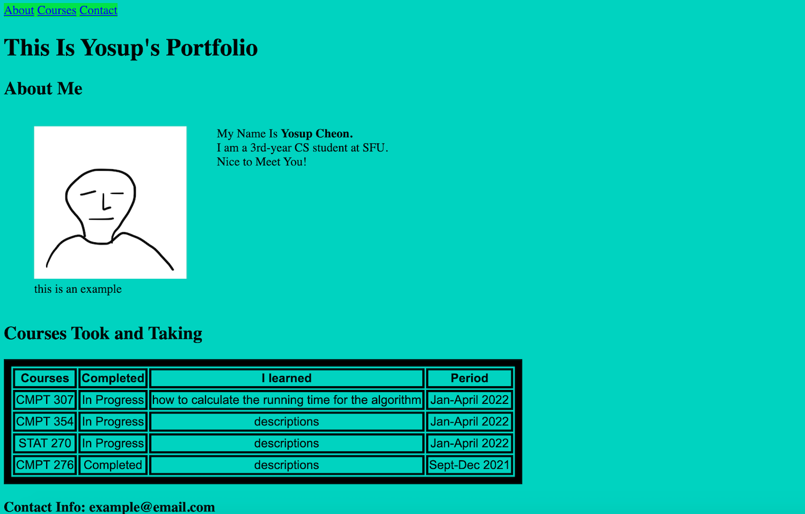
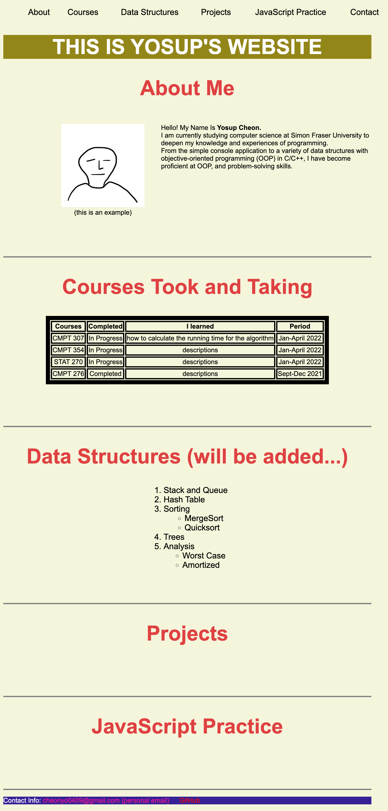
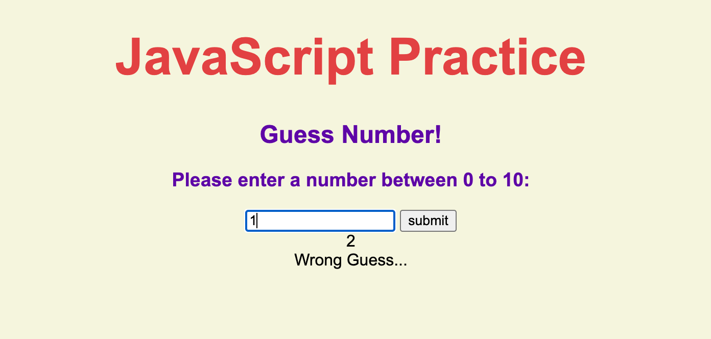
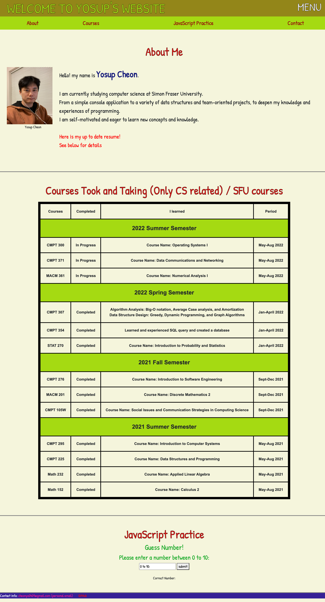

# yosupCheon.github.io

<h1>This is my own website</h1>

I started creating this website on March 10, 2022.

March 11, 2022
- Studied some HTML and CSS 
- Constructed the basics of the webpages
- Screenshot: 
-------------------------------------------------------------
March 16, 2022
- Updated overall design
- Added Menu bar on the top
- Need to Fix:
    - empty space on the right side (update-Mar20: completed)
    - adding resume pdf file (update-Mar20: completed)
    - deploy does not work sometime and work sometimes (update-Mar20: works if deploy with interval of 15 minutes)
- Need to Do:
    - complete contents of each section
    - start study about JavaScript and then jQuery library
- Screenshot: 

-------------------------------------------------------------
March 20, 2022
- Added Random Number Guess progeram with JavaScript
- : a user insert a number (0-10) to guess a random number
- Need to Fix:
    - : for example, "3withInvalid" still works because of 3 infront of the input item (fixed)
- Need to Do:
    - complete the contents
    - more projects with JavaScript and then jQuery library
    - projects with python...
- Screenshot: 

-------------------------------------------------------------
May 16, 2022
- Organized the webpage and update the info.
- Need to Fix:
    - Previous errors (completed)
    - Finishing updating the info (completed)

-------------------------------------------------------------
May 29/30, 2022
- Organized the webpage and update the info.
- Need to Fix:
    - Done
- Screenshot: 
-------------------------------------------------------------